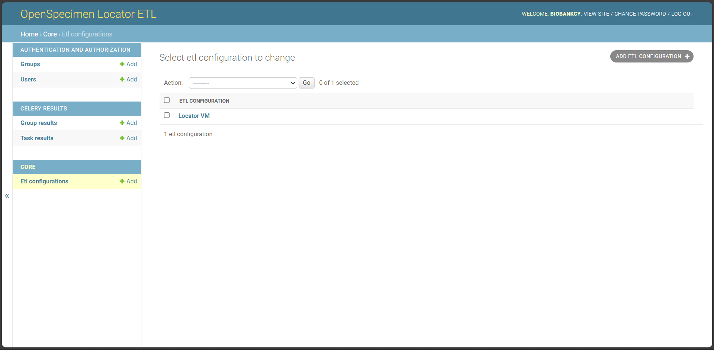

# OpenSpecimen ETL to BBMRI-Locator FHIR resources

> **WARNING**  
> This project is currently under development. Please use with caution.

## Overview

The OpenSpecimen(tm) BIMS Locator ETL is a flexible pipeline designed for 
biobanks utilizing OpenSpecimen as their BIMS (Biobanking 
Information Management System). Its primary purpose is to 
streamline integration with the 
[BBMRI-ERIC Sample Locator](https://locator.bbmri-eric.eu/) 
project.

## Key Features

* **Multiple Configurations:** Allows for integration with 
multiple OpenSpecimen sources and offers the flexibility to 
target multiple FHIR destinations.
* **Scheduling:** Enables the setup of periodic runs for 
specific configurations, enhancing automation and efficiency.
* **History Tracking:** Provides a comprehensive history 
of past runs, complete with statistical data and status updates.

## Technical Insight

* This project utilizes the OpenSpecimen API to extract data 
from the biobank repository. To facilitate this, it requires 
the creation of a read-only Robot user in OpenSpecimen.
* Data extraction from OpenSpecimen relies on the presence of 
a predefined query containing all the data destined for the 
Locator project.
* The Bridgehead component must run on a separate virtual 
machine, necessitating the provision of appropriate 
credentials (username/password) during the load step.
* The ETL project is a customized Django Admin application 
integrated with Celery for efficient scheduling and task 
management.

## Setup Guidelines

* A Dockerfile is available to simplify the setup and 
execution of this project.
* Ensure the availability of a persistent directory 
for `/app/data` to retain configuration details and 
historical run statistics.
* For additional assistance, please feel free to contact [myerou02@ucy.ac.cy](mailto:myerou02@ucy.ac.cy).

## Future Enhancements and Limitations

While we have strived to make the ETL process highly 
configurable, we acknowledge that it may not cater to every 
unique biobank's requirements. We encourage you to reach out to 
us or actively contribute to the project if you require greater 
flexibility or have specific needs. Your feedback and 
involvement are highly valued.

## Run

1. Create a user for the ETL system:
   1. (Optional) If you are missing Python dependencies, 
      run `pip install -r ./requirements.txt`
   2. Run `mkdir data` to create a folder to store persistent data
   3. Run `python manage.py migrate` to create the local DB
   4. Run `python manage.py createsuperuser`
   and follow the instructions 
2. Run `./local_build_and_run.sh` (on a Linux-based OS). Install [Docker](https://www.docker.com/) 
on your system if needed.
3. Login with the credentials created before, and configure the ETL pipeline.

## Screenshots

